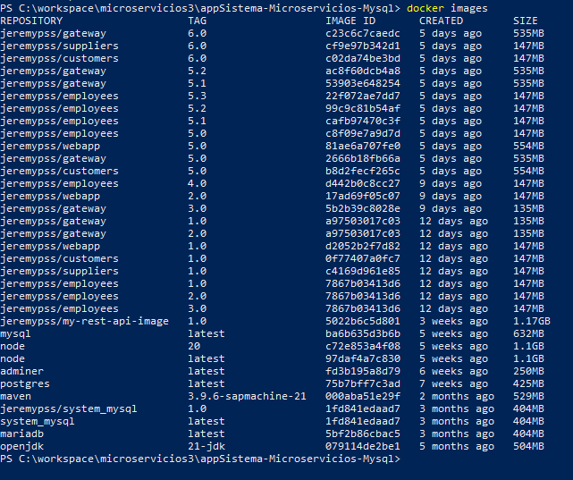

## AppSystem Microservices and Containers

***

**Installation and Usage**
- Download the [reporsitory](https://github.com/JeremyPSS/containers-microservices-mp.git)
  - `git clone https://github.com/JeremyPSS/containers-microservices-mp.git`
- Download **Docker**
  - For Windows you can download on the official [website](https://docs.docker.com/desktop/install/windows-install/)
  - For linux you can use a package manager
  ```bash
  sudo apt install docker.io docker-compose -y
  sudo systemctl start docker
  sudo usermod -aG docker $USER
  sudo systemctl restart docker
  ```
  Then **Logout** on your linux machine

- Run `docker-compose up -d` on your `docker-compose.yml` ubication
- Open a browser and go to `http://localhost:8080`
- To restore the data
  -  Go to `http://localhost:8282`
  -  The creadentials are
     - password: `root`
     - username: `root`
     - server: `db`
     - database: `system`
  - On import select the file `system.sql` and click on `execute`

**Considerations**
- By default, the gateway only runs on port 8080 (this is the main port for the user)
- You can change the ports on each microservice, on `/src/main/resources/application.yml or /src/main/resources/application.properties`
  - To apply the changes you might run `mvn package` to generate the .jar or .war file again
    - Take in consideration the java version (check on each `pom.xml`)
- After running the containers, you can still use the API, you can verify using `http://localhost:portMicroservice/api/nameMicroservice`
  - Or in console you can test with `curl [urlAPI]` o
- You need to restore the database, you can do this with the adminer container
- To fetch the data with each microservice take time, so be patient


***

**Microservices**
Ports:
- employees: 9000
- customers: 9001
- suppliers: 9002
- webapp:    9003

**Containers**
Ports:
- employees: 9000 (jdk8)
- customers: 9001 (jdk8)
- suppliers: 9002 (jdk8)
- webapp:    9003 (jdk21)
- gateway:   8080 (jdk21)
- database:  3306 (mariadb)
- adminer:   8282

***

Screenshots:





